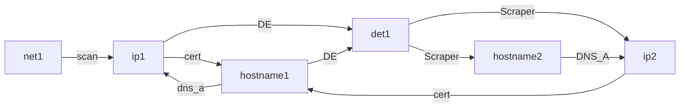
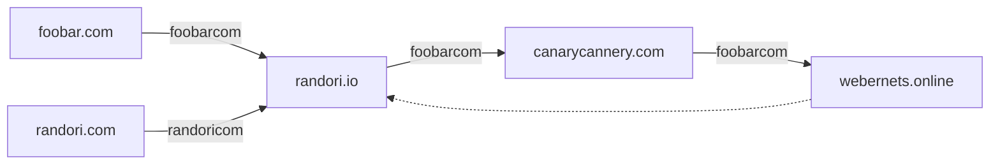
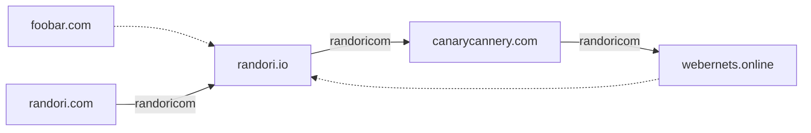
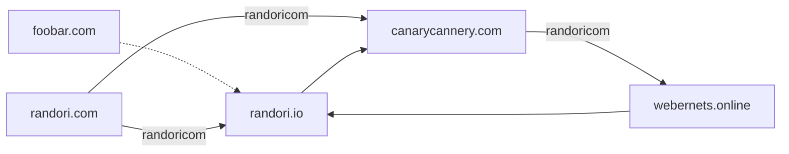
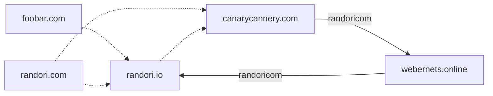

- 👋 Hi, I’m @TylerRandori
- 👀 I’m interested in ...
- 🌱 I’m currently learning ...
- 💞️ I’m looking to collaborate on ...
- 📫 How to reach me ...

<!---
TylerRandori/TylerRandori is a ✨ special ✨ repository because its `README.md` (this file) appears on your GitHub profile.
You can click the Preview link to take a look at your changes.
--->


​
# `foobar.com` authority
`foobar.com` propogates to `randori.io` all the way to `wbernets.online`
The whole propogation path is recorded to prevent looping the propogation backto `randori.io` form `webernets.online`
`randori.com` could have been used for `randori.io` authority, but wasn't the chosen path.

# `foobar.com` authority is rescinded
`foobar.com` no longer has authority to propogate. On next refresh `randori.io` inherits authority by propogation from `randori.com`. Downstream entities still perceive authority from `foobar.com`
The now legacy propogation still contains `randori.io` and still prevents looping the propogation backto `randori.io` form `webernets.online`

# `foobar.com` authority is rescinded at `canarycannery.com`
​

# `foobar.com` authority is rescinded at `webernets.online`
​

​
# garbage

​
```mermaid
graph LR
foobar.com .-> randori.io
randori.com --randoricom--> canarycannery.com
randori.com --randoricom--> canarycannery2.com
randori.io --> canarycannery2.com
​
canarycannery2.com --randoricom--> webernets.online 
randori.com  --randoricom--> randori.io --> canarycannery.com --randoricom--> webernets.online 
webernets.online --> randori.io
```
​

​
Exigent in practice, but we can totally get flopping self-sustaining authority (propogation) loops
​
- record the propogation path per entity
- neighborhood message includes:
  - parents
  - children **1
  - related by hostname (my hostname ends in this and it has authority/nonauthority)
  - related by ip/network (my ip is contained by this and it has authority/nonauthority)
  - related by detection containment (my detection wholly contains and it has authority)? **2
  - related by propogation path or propogation root **3
​
​
**1 - not sure where we're using childred
**2 - not sure we need detection containment or if hostname / ip is sufficient shortcut
**3 - see discussion above --> knowing root of authority path is sufficient to prevent self-sustaining loops/flopping, we might want to get this in the message up front, if not the entities for the whole path
​
​
Can i make paths optimized in some way? Record pathid,position in entity?
​
​
- do i need all paths?
  - Answer has to be no.
    - How do we make it no?
